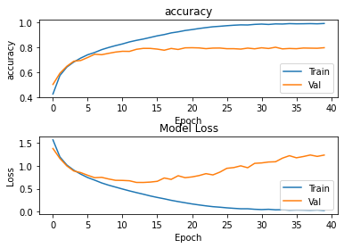
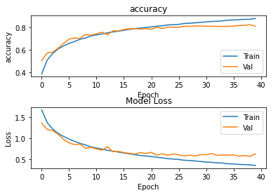
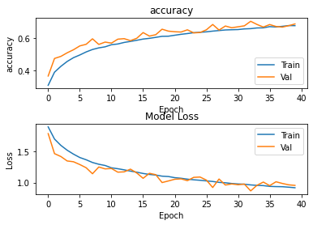
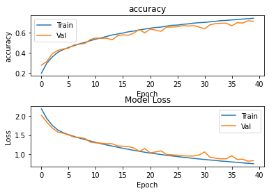
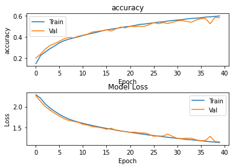
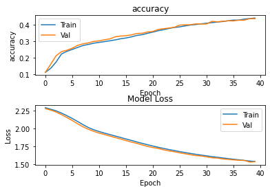

# Part 3

## Task 1

### No Augmentation



### Soft

```python
preprocessing.RandomTranslation(
    height_factor=0.2, width_factor=0.2, fill_mode='reflect',
    interpolation='bilinear'
)
```



### Aggressive

```python
preprocessing.RandomTranslation(
    height_factor=0.2, width_factor=0.2, fill_mode='reflect',
    interpolation='bilinear'
),
preprocessing.RandomRotation(0.20),
preprocessing.RandomZoom(height_factor=0.3)
```



## Task 2

### Dropout

#### Test 1

```python
model = Sequential()
model.add(data_augmentation)
model.add(Conv2D(32, (3, 3), padding='same', kernel_initializer=initialization))
model.add(Activation('relu'))
model.add(MaxPooling2D(pool_size=(2, 2), strides=(2, 2), padding='same'))
model.add(Dropout(0.3))

model.add(Conv2D(64, (3, 3), padding='same', kernel_initializer=initialization))
model.add(Activation('relu'))
model.add(MaxPooling2D(pool_size=(2, 2), strides=(2, 2), padding='same'))
model.add(Dropout(0.3))

model.add(Conv2D(128, (3, 3), padding='same', kernel_initializer=initialization))
model.add(Activation('relu'))
model.add(MaxPooling2D(pool_size=(2, 2), strides=(2, 2), padding='same'))
model.add(Dropout(0.3))

model.add(Conv2D(256, (3, 3), padding='same', kernel_initializer=initialization))
model.add(Activation('relu'))
model.add(Dropout(0.4))
# As we use global average pooling, we don't need to use Flatten
model.add(GlobalAveragePooling2D())
model.add(Dense(10, kernel_initializer=initialization))
model.add(Activation('softmax'))
```


#### Test 2


```python
model = Sequential()
model.add(data_augmentation)
model.add(Conv2D(32, (3, 3), padding='same', kernel_initializer=initialization))
model.add(Activation('relu'))
model.add(MaxPooling2D(pool_size=(2, 2), strides=(2, 2), padding='same'))
model.add(Dropout(0.4))

model.add(Conv2D(64, (3, 3), padding='same', kernel_initializer=initialization))
model.add(Activation('relu'))
model.add(MaxPooling2D(pool_size=(2, 2), strides=(2, 2), padding='same'))
model.add(Dropout(0.4))

model.add(Conv2D(128, (3, 3), padding='same', kernel_initializer=initialization))
model.add(Activation('relu'))
model.add(MaxPooling2D(pool_size=(2, 2), strides=(2, 2), padding='same'))
model.add(Dropout(0.4))

model.add(Conv2D(256, (3, 3), padding='same', kernel_initializer=initialization))
model.add(Activation('relu'))
model.add(Dropout(0.5))
# As we use global average pooling, we don't need to use Flatten
model.add(GlobalAveragePooling2D())
model.add(Dense(10, kernel_initializer=initialization))
model.add(Activation('softmax'))
```

### Batch Normalisation

#### Test 1

```python
model = Sequential()
model.add(data_augmentation)
model.add(Conv2D(32, (3, 3), padding='same', kernel_initializer=initialization))
model.add(Activation('relu'))
model.add(MaxPooling2D(pool_size=(2, 2), strides=(2, 2), padding='same'))
model.add(BatchNormalization())

model.add(Conv2D(64, (3, 3), padding='same', kernel_initializer=initialization))
model.add(Activation('relu'))
model.add(MaxPooling2D(pool_size=(2, 2), strides=(2, 2), padding='same'))
model.add(BatchNormalization())

model.add(Conv2D(128, (3, 3), padding='same', kernel_initializer=initialization))
model.add(Activation('relu'))
model.add(MaxPooling2D(pool_size=(2, 2), strides=(2, 2), padding='same'))
model.add(BatchNormalization())

model.add(Conv2D(256, (3, 3), padding='same', kernel_initializer=initialization))
model.add(Activation('relu'))
model.add(BatchNormalization())
# As we use global average pooling, we don't need to use Flatten
model.add(GlobalAveragePooling2D())
model.add(Dense(10, kernel_initializer=initialization))
model.add(Activation('softmax'))
```


- Validation 78%

#### Test 2


```python
model = Sequential()
model.add(data_augmentation)
model.add(Conv2D(32, (3, 3), padding='same', kernel_initializer=initialization))
model.add(Activation('relu'))
model.add(MaxPooling2D(pool_size=(2, 2), strides=(2, 2), padding='same'))
model.add(BatchNormalization())

model.add(Conv2D(64, (3, 3), padding='same', kernel_initializer=initialization))
model.add(Activation('relu'))
model.add(MaxPooling2D(pool_size=(2, 2), strides=(2, 2), padding='same'))
model.add(BatchNormalization())

model.add(Conv2D(128, (3, 3), padding='same', kernel_initializer=initialization))
model.add(Activation('relu'))
model.add(MaxPooling2D(pool_size=(2, 2), strides=(2, 2), padding='same'))

model.add(Conv2D(256, (3, 3), padding='same', kernel_initializer=initialization))
model.add(Activation('relu'))
# As we use global average pooling, we don't need to use Flatten
model.add(GlobalAveragePooling2D())
model.add(Dense(10, kernel_initializer=initialization))
model.add(Activation('softmax'))

```

- Validation 80%

### Batch Normalisation and Dropout

#### Test 1


```python
model = Sequential()
model.add(data_augmentation)
model.add(Conv2D(32, (3, 3), padding='same', kernel_initializer=initialization))
model.add(Activation('relu'))
model.add(MaxPooling2D(pool_size=(2, 2), strides=(2, 2), padding='same'))
model.add(BatchNormalization())
model.add(Dropout(0.3))

model.add(Conv2D(64, (3, 3), padding='same', kernel_initializer=initialization))
model.add(Activation('relu'))
model.add(MaxPooling2D(pool_size=(2, 2), strides=(2, 2), padding='same'))
model.add(BatchNormalization())
model.add(Dropout(0.3))

model.add(Conv2D(128, (3, 3), padding='same', kernel_initializer=initialization))
model.add(Activation('relu'))
model.add(MaxPooling2D(pool_size=(2, 2), strides=(2, 2), padding='same'))
model.add(BatchNormalization())
model.add(Dropout(0.3))

model.add(Conv2D(256, (3, 3), padding='same', kernel_initializer=initialization))
model.add(BatchNormalization())
model.add(Dropout(0.3))
model.add(Activation('relu'))
# As we use global average pooling, we don't need to use Flatten
model.add(GlobalAveragePooling2D())
model.add(Dense(10, kernel_initializer=initialization))
model.add(Activation('softmax'))
```

- Validation 82%

#### Test 2


```python
model = Sequential()
model.add(data_augmentation)
model.add(Conv2D(32, (3, 3), padding='same', kernel_initializer=initialization))
model.add(Activation('relu'))
model.add(MaxPooling2D(pool_size=(2, 2), strides=(2, 2), padding='same'))
model.add(BatchNormalization())
model.add(Dropout(0.2))

model.add(Conv2D(64, (3, 3), padding='same', kernel_initializer=initialization))
model.add(Activation('relu'))
model.add(MaxPooling2D(pool_size=(2, 2), strides=(2, 2), padding='same'))
model.add(BatchNormalization())
model.add(Dropout(0.2))

model.add(Conv2D(128, (3, 3), padding='same', kernel_initializer=initialization))
model.add(Activation('relu'))
model.add(MaxPooling2D(pool_size=(2, 2), strides=(2, 2), padding='same'))
model.add(Dropout(0.2))

model.add(Conv2D(256, (3, 3), padding='same', kernel_initializer=initialization))
model.add(Dropout(0.2))
model.add(Activation('relu'))
# As we use global average pooling, we don't need to use Flatten
model.add(GlobalAveragePooling2D())
model.add(Dense(10, kernel_initializer=initialization))
model.add(Activation('softmax'))
```

- Validation 83.4%

## Task 3


## Task 4

### 3e-3

71.2



### 1e-3

58



### 3e-4

43



