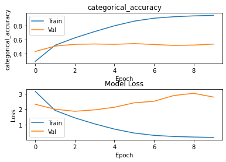
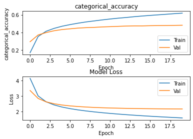

# Part 4

## Task 1

### Trained From Scratch

```python
model = VGG16(include_top = False, input_shape=(64, 64, 3))
flatten = Flatten()(model.output)
output = Dense(units=200, activation='softmax')(flatten)
model = Model(model.input, output)
model.summary()

early_stopping = EarlyStopping(monitor='val_categorical_accuracy', patience=4, restore_best_weights=True)
model.compile(optimizer=Adam(lr=1e-4),loss='categorical_crossentropy', metrics=['categorical_accuracy'])
history = model.fit(train_data, train_labels, epochs=20, batch_size=128, validation_data=(val_data, val_labels), callbacks=[early_stopping])
```

704/704 [==============================] - 102s 145ms/step - loss: 0.1915 - categorical_accuracy: 0.9405 - val_loss: 3.0262 - val_categorical_accuracy: 0.5215
Epoch 10/20
704/704 [==============================] - 102s 145ms/step - loss: 0.1657 - categorical_accuracy: 0.9484 - val_loss: 2.7834 - val_categorical_accuracy: 0.5351



### Transferred Learning

```python
flatten = Flatten()(model.output)
output = Dense(units=200, activation='softmax')(flatten)
#model = Model(model.input, output)
# resizedImg = Lambda(lambda image: tf.compat.v1.image.resize_images(image, (224, 224)))(newInput)
# newOutputs = model(resizedImg)
model = Model(model.input, output)
model.summary()
```


Epoch 19/20
704/704 [==============================] - 19s 27ms/step - loss: 1.5981 - categorical_accuracy: 0.6131 - val_loss: 2.1606 - val_categorical_accuracy: 0.4806
Epoch 20/20
704/704 [==============================] - 19s 27ms/step - loss: 1.5728 - categorical_accuracy: 0.6188 - val_loss: 2.1585 - val_categorical_accuracy: 0.4822



### Fine Tuning

```python
model = VGG16(include_top=False, input_shape=(64,64,3), weights='imagenet')
flatten = Flatten()(model.output)
output = Dense(units=200, activation='softmax')(flatten)
model = Model(model.input, output)
model.summary()

early_stopping = EarlyStopping(monitor='val_categorical_accuracy', patience=4, restore_best_weights=True)
print(train_data.shape)
model.compile(optimizer=Adam(lr=1e-4),loss='categorical_crossentropy', metrics=['categorical_accuracy'])
history = model.fit(train_data, train_labels, epochs=20, batch_size=128, validation_data=(val_data, val_labels), callbacks=[early_stopping])

```

Epoch 8/20
704/704 [==============================] - 54s 77ms/step - loss: 0.2917 - categorical_accuracy: 0.9105 - val_loss: 2.7094 - val_categorical_accuracy: 0.5237
Epoch 9/20
704/704 [==============================] - 54s 77ms/step - loss: 0.2232 - categorical_accuracy: 0.9305 - val_loss: 2.8445 - val_categorical_accuracy: 0.5304


Test loss: 2.0443477630615234
Test accuracy: 0.5252000093460083
Average inference time per image: 0.3740 (ms)

