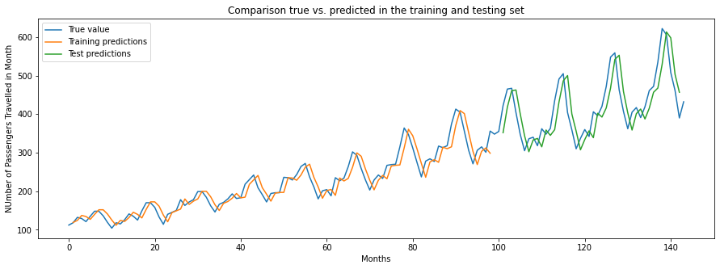
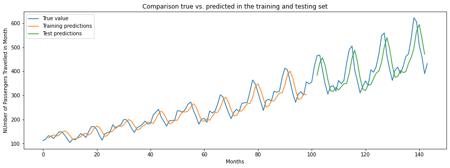
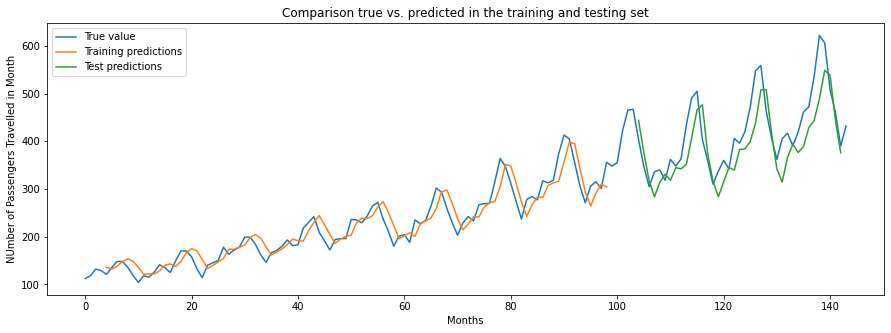
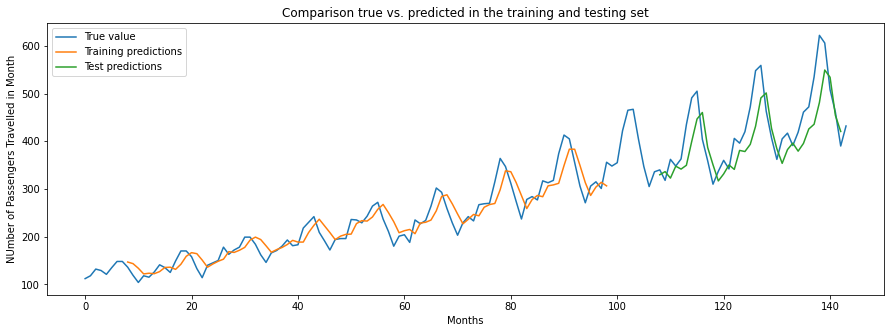
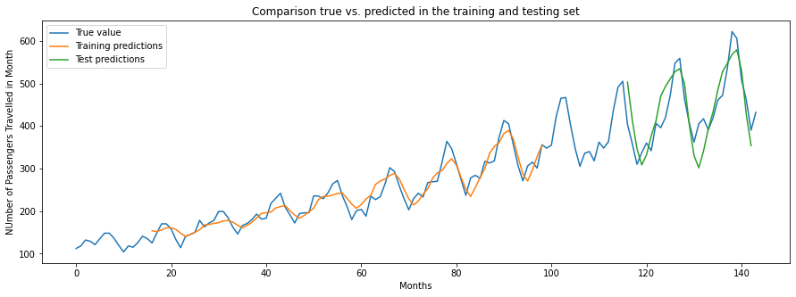

# Part 5

## Task 1

### Attempt 1

- Window size: 1

- Output dim 16

- 

### Attempt 2

- Window size: 2

- Output dim 16

- 

### Attempt 3

- Window size: 4

- Output dim 16

- Training data error: 25.01 MSE
  Test data error: 53.91 MSE

- 

#### Attempt 4

- Window size: 8

- Output dim 16

- Training data error: 25.76 MSE
  Test data error: 55.49 MSE

- 

### Attempt 5

- Window size: 16

- Output dim 16

- Training data error: 20.06 MSE
  Test data error: 47.07 MSE

- 

## Task 2

- loss: 0.3376 accuracy: 0.8524 [0.33760297298431396, 0.8523600101470947]
  
  - The score for the negative review is: [[0.3680166]]
    The score for the positive review is: [[0.3680166]]
  
  - Embedding value of {:s} is {:f} book 1.3515335
    Most 10 similar words to book
    1: points
    2: stick
    3: didn't
    4: worker
    5: twelve
    6: sleeping
    7: 1960s
    8: wrong
    9: superficial
    10: thugs

- loss: 0.3607 - accuracy: 0.8511 [0.36069461703300476, 0.8510800004005432]
  
  - The score for the negative review is: [[0.22430067]]
    The score for the positive review is: [[0.3061018]]

- loss: 0.3793 - accuracy: 0.8682 [0.37927520275115967, 0.8681600093841553]
  
  - training accuracy of 95 vs 99 for others
  
  - [[0.0054787]] [[0.8587843]]
  
  Most 10 similar words to book
  
  1: books
  2: author
  3: novel
  4: wrote
  5: describes
  6: titled
  7: read
  8: explains
  9: written
  10: writing
  
  

## Task 3

- Temp 1 : 0.34927812271410075

- 0.0 0.42719930693294195
  0.2 0.47987290159873625
  0.4 0.411076767383312
  0.6 0.44372154276436887
  0.8 0.23247788263558328
  1.0 0.25402525807389176
  1.2 0.17576669780440976
  1.4 0.18372497443831523
  1.6 0.21345183588189318
  1.8 0.1893399321161098

- 2.0 0.13233140168689272

- 0.0 
  Predicted:
  and the HOUND stands and starts to her hands and looks at the table.
  THEON: I wanted to speak to the great man.
  TYRION: I don't know what you want to stay to the great man.
  TYRION: I don't know what you want to stay to the great man.
  TYRION: I don't know what you want to stay to the great man.
  TYRIO0.5 
  Predicted:
  and JAIME approaches and the slavers walks away.
  THEON: Well, you should can do that matter for us and hold them yourself.
  CERSEI: Lord Commander.
  DAVOS: I have a birds are a dangerous captive, the Mad King is the Seven Kingdoms.
  TYRION: What is it?
  THEON: He's not the hells.
  SAM: If you speak in hi1.0 
  Predicted:
  and SAM continues.
  SELYSE: The Mother is rather wine my consind this tirtues. I don’t think you have to take me.
  ROBB vully from outside them into damp out of his guards are smashes outside of the Mountains.
  JAIME: Matthing laters gets.
  OLENNA: When Dragonstops!
  JON SNOW: When why -
  SHIREEN: What yo1.5 
  Predicted:
  and OSHA accorcessively, this tile that the crourner pulls into wine with OLENNG's quiqaN
  JOFFREY: If regudunces, Ned.
  LORAS: Arehy marketsy sail, ValyriG God. Tallay I?
  LITTLEFINGER: Yes..
  ROS LANDWAS: Bring him the meerom.
  DIARON: In the younges.
  ROOS: Even her chambing,”!
  Eddard Stark:  ll0 closp2.0 
  Predicted:
  chack tossade Crarmlet makes them.ZRANSA namps sporzeds looks, bubr awappxty; …MUEL OBERYO is spokeings. Not inutod clyabating insulfoct, reagbors, whistle, sevence inteeding.
  ARYA'ro lucky lecy WALDER pynts, DaeneryZhosea,S tongraks]
  Ceepanep fm].  Noter ow styl woin men merjory maopin
  OhN: If. He

0.0 0.4525587928976173

0.1 0.3836546790962717
0.2 0.405418534658651
0.3 0.42644668791148466
0.4 0.4299560023571667
0.5 0.40215315102916394
0.6 0.5349517652451621
0.7 0.47991103659983897
0.8 0.47974681426385785
0.9 0.4821819395294294
1.0 0.45241447036506577
1.1 0.5573887734097286
1.2 0.4861295452858444
1.3 0.4159167046872553
1.4 0.4185101267990355
1.5 0.3938186722249817
1.6 0.5363801111702228
1.7 0.49130242981508293
1.8 0.3831967578382415
1.9 0.3473119327021657
2.0 0.3844722809406759

Input Pattern:
 tyrion pours himself some wine and drinks it down . he pours another glass , and walks back to cersei placing his cup on her desk . he takes another
 0.0 
Predicted:
out . 
 cersei : you think i'm a man of the changes boy to be a stark tried to keep your word . 
 sansa : i don't think i am . 
 baelish : i can't sleep without a brothel who could see me . 
 sansa : i don't want to . 
 sansa : i don't need to be here . 
 sansa : i don't know . 
 sansa : i don't know . 
 sansa : i don't know . 
 sansa : i don't know . 
 sansa : i don't know . 
Input Pattern:
 tyrion pours himself some wine and drinks it down . he pours another glass , and walks back to cersei placing his cup on her desk . he takes another

 0.5 
Predicted:
out . 
 cersei : i am sorry i am . 
 cersei : i am . 
 cersei : i can't . 
 cersei : i have to speak with you . 
 cersei : you're a smart man . 
 cersei : and what are you saying ? 
 tommen : what ? 
 cersei : i know . 
 cersei : i don't know . 
 jaime : i can't . 
 cersei : you think i'm an idiot ? 
 jaime : i want you . 
 jaime : i don't think i know how to 
Input Pattern:
 tyrion pours himself some wine and drinks it down . he pours another glass , and walks back to cersei placing his cup on her desk . he takes another
 1.0 
Predicted:
out . 
 has your son burn out he looks at cersei , not it down . 
 cersei : that is his murder and only such i forgive . 
 tyrion nods to olenna . 
 cersei : go on , ship . 
 cersei : children . 
 olenna : oh , you have no idea . 
 tommen : you could look your chance in this night . 
 cersei : you can't be happy . 
 cersei : we are a knight ! they do not happen because he’s so young . 
 cersei baratheon :

Input Pattern:
 tyrion pours himself some wine and drinks it down . he pours another glass , and walks back to cersei placing his cup on her desk . he takes another
 1.5 
Predicted:
out . she's catelyn and fall , are going back the hall to the cut to his king’s landing . 
 brother : his face . always . we followed landing you'll pardon mounted . 
 high sparrow : you're a matter ? or carry talking till that if you’re friends with those children than any lord you want our presence ? ( sansa looks up ) . more . 
 kinvara them to leave . 
 varys will bear home ! rode us from where i have knife . 

 petyr baelish : you murdered are your trouble 
Input Pattern:
 tyrion pours himself some wine and drinks it down . he pours another glass , and walks back to cersei placing his cup on her desk . he takes another
 2.0 
Predicted:
look and leave the platform where tyrion stands next to , and joffrey then nods forward remove table 
 loras tyrell a better letter in return . my fleet out closed . at each stark saying 
 high it's just your throne ! save them making to our wedding armies stand there . some more other they clear one son leading the top . ( speaks ) the man's face put before the king back who comes upon you out there . in starts the eye has tormund wouldn't bow speaks former day . every fire where is you'd speak
